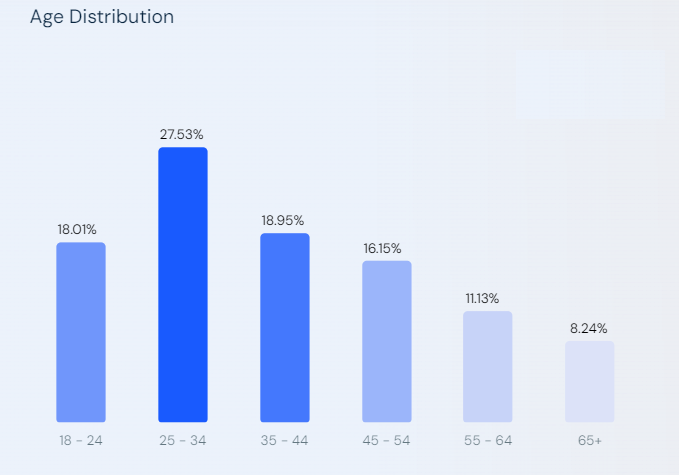

# Проектирование платформы "Букмейт" - сервиса для чтения и прослушивания книг

## Содержание

- ### [Тема и целевая аудитория](#1_part)
- ### [Расчет нагрузки](#2_part)
- ### [Глобальная балансировка нагрузки](#3_part)
- ### [Источники](#sources)

## 1. Тема и целевая аудитория 

- Область присутствия - Россия
- Аналитика по возрастным группам

- Распределение пользователей по полу:
    - Женщины - 49.91%
    - Мужчины - 50.09%

### Функционал

- Регистрация
- Чтение книг/комиксов
- Прослушивание аудиокниг
- Полки
- Отзывы на книги/аудиокниги/комиксы
- Поиск

## 2. Расчет нагрузки 

### Продуктовые метрики

- [Согласно представленной информации](https://www.similarweb.com/website/bookmate.ru/#demographics), значение ***MAO*** составляет ***4.3 млн. пользователей***
- По размеру дневной аудитории не удалось найти информацию в открытых источниках, потому определим показатель ***DAO***, исходя из приблизительных вычислений:
    - Т.к. небольшой процент людей читает на каждодневной основе, возьмем приближенный коэффициент ***~0.3*** от числа уникальных пользователей в месяц, получаем
      
    > 0.3*4.3 = 1.29 млн. пользователей в сутки

- Интенсивность использования разных функций:
    1. Чтение книг:
        - Опорная метрика - ***среднее количество страниц, читаемых пользователем в день***. По причине отсутствия этой и подобных метрик примем значение с некоторой погрешностью: ***3.8 страниц в день***
    2. Прослушивание аудиокниг:
        - Примем следующее значение: ***1.2 мин. в день***
    3. Просмотр комиксов:
        - Примем следующее значение: ***0.001 страницы в день***
    4. Написание отзывов:
        - Примем следующее значение: ***0.0002 отзыва в день***
    5. Использование поиска:
        - Примем следующее значение: ***0.8 запроса в день***

| Действие | Ср. значение метрики |
| --- | --- |
| Чтение страниц | 3.8 [шт.] |
| Прослушивание аудиокниги | 1.2 [мин.] |
| Чтение комиксов | 0.001 [шт.] |
| Написание отзыва | 0.0002 [шт.] |
| Поисковый запрос | 0.8 [шт.] |
- Объем данных пользователя:
    - ***Данные аккаунта*** - ~25Кб (размер аватарки с учетом сжатия - ~20Кб, размер прочих текстовых данных - ~5 Кб)

## Технические метрики

### Размер хранения

### 1. Аудио

- [Согласно актуальным источникам](https://www.forbes.ru/forbeslife/482707-andeks-zapustil-servis-elektronnyh-i-audioknig-bukmejt-dla-pol-zovatelej-plusa), в книжном сервисе есть доступ к 170 тыс. аудиокнигам. [Средняя продолжительность аудиокниги составляет 10 часов](https://wordsrated.com/audiobook-statistics/#:~:text=Generally%2C%20around%209%2C300%20words%20of,containing%20close%20to%20100%2C000%20words.), то есть нужно хранить:
    
    > 320 * 60 = 19200 кбит/мин - размер 1-ой минуты видео
    > 
    
    > ((19200 * 60 * 10) * 170.000) * 1000 / 8  = 0.244 Пбайт
    > 
    

### 2. Книги

- [Средний размер цифровой книги - ~1-3 Мбайт](https://blog.rt.ru/b2c/elektronnaya-kniga-na-chto-obratit-vnimanie-pri-pokupke.htm?ysclid=lt2ziifd6h589690657), округлим в большую сторону, тогда для хранения книг необходимо хранилище размером:
    
    > 3 * 1.000.000 * 1.000.000 = 3000 Тбайт
    > 
- [Каталог комиксов не столь обширен](https://mel.fm/novosti/4597213-v-bukmeyte-poyavilsya-razdel-s-komiksami), их в расчет не берем.

### Трафик

### 1. Аудио

- Суммарный суточный трафик составит:
    
    > (19200 кбит/мин * 1000/8)* 1.2 мин/день * 1.29 млн. пользователей/день = 3715 Тбайт/сутки
    > 
- То есть на протяжении суток в среднем получаем следующий трафик по аудио:
    
    > 3715 / 86400 = 43 Мбайт/с
    > 

### 2. Книги

- Суммарный суточный трафик составит:
    - Примем средний размер страницы теста ~ 5 Кбайт
    
    > 1.29 * 1.000.000 * 3.8 * 5000 / 86400 = 24.7 Тбайт/сутки
    > 
- То есть на протяжении суток в среднем получаем следующий трафик по аудио:
    
    > 24.7 / 86400 = 286 Кбайт/с
    > 

### RPS в разбивке по типам запросов

- 3.8 страниц, читаемых в день в переводе на запросы с пагинацией - 4 запроса, тогда:
    
    > 4 запроса  * 1.29 млн. пользователей / 86400 = 60 RPS
    > 
- Положим, сервис отдает аудио чанками размера 8 Кбайт, тогда:
    
    > (320 кбит/c * 60) * 1.2 мин/день * 1.29 млн. пользователей / 86400 = 335 RPS
    > 
- Поисковые запросы:
    
    > 0.8шт * 1.29 млн. пользователей / 86400 = 11 RPS
    > 
- Для комиксов 1 страница - 1 запрос:
    
    > 0.001шт * 1.29 млн. пользователей  / 86400
    > 
    
    | Действие | RPS |
    | --- | --- |
    | Запрос страницы | 60 |
    | Запрос фрагмента аудио | 335 |
    | Поисковый запрос | 11 |

---

## 3. Глобальная балансировка нагрузки 

**Расположение датацентров**

[Целевая аудитория сервиса расположена преимущественно в России](https://www.similarweb.com/ru/website/livelib.ru/#traffic), значит все ДЦ целесообразно располагать на территории РФ.

Основное количество ДЦ расположим в европейской части страны, поскольку большая часть трафика приходится именно на ее регионы. Однако необходимо учесть и процент пользователей из Сибири, Дальнего Востока, [поскольку в данных регионах также высока доля активных интернет-пользователей.](https://finexpertiza.ru/press-service/researches/2022/kolich-inter-polz-vyrosl/)

Необходимо разместить ДЦ в нескольких городах федерального значения, таких как Москва и Санкт-Петербург, поскольку процент пользователей сервиса в данных городах наибольший, к тому же необходимо физически близкое расположение ДЦ к основным офисам для скорейшей отладки в самом ДЦ в случае неисправностей, устранимых только вручную инженерами непосредственно в ДЦ. 

***Предварительный список городов для расположения ДЦ:***

- Москва - покрытие МО и ближайших областей
- Санкт-Петербург - покрытие ЛО и ближайших областей
- Казань - Европейская часть России
- Новосибирск - Западная Сибирь
- Якутск - Дальний Восток

Чтобы убедиться, что схема расположения ДЦ выбрана правильно, оценим RTT из краевых точек до выбранных городов:

- Краснодар → Казань - 42.98 мс
- Мурманск → Санкт-Петербург - 68.52 мс
- Владивосток → Якутск - 49.90 мс
- Петропавловск-Камчатский → Якутск - 62.32 мс
- Норильск → Новосибирск - 72.55 мс

Поскольку значение RTT находится в допустимых пределах([100 мс](https://edgecenter.ru/blog/what-latency-is-and-how-to-reduce-it)), утверждаем выбранный список городов.

**Глобальная балансировка**

Технология GeoDNS позволит определять физически ближайший к пользователю ЦОД. В Cache NS клиента будут храниться IP адреса ближайших к нему датацентров.

## 4. Локальная балансировка нагрузки

Для начала необходимо определиться с механизмом L3 балансировки. Выберем балансировку по схеме Virtual Server via IP Tunneling для предотвращения проблемы “бутылочного горлышка” в случае прохождения всего трафика исключительно через балансировщик нагрузки.

Для обеспечения отказоустойчивости системы и мониторинга нод будем использовать фреймворк *keepalived.*

Используется протокол **Virtual Router Redundancy Protocol(VRRP)**. Соответственно, получаем возможность мониторить состояние нод и перенаправлять трафик в случае отказа одного из узлов.

Далее необходимо определиться с механизмом L7 балансировки в случае одного экземпляра сервера. 

На отдельно взятом сервере будет проходить балансировка с помощью L7. Будем использовать балансировщик traefik, являющийся наиболее распространенным решением для балансировки на уровне сервисов.

Для шифрования будем пользоваться услугами центра [Let's encrypt](https://letsencrypt.org/). Установка соединения - дорогостоящий по времени процесс, поэтому будем использовать Session Cache для улучшения производительности.

---

## Источники: 

1. [bookmate.ru Traffic Analytics, Ranking Stats & Tech Stack | Similarweb](https://www.similarweb.com/website/bookmate.ru/#demographics)
